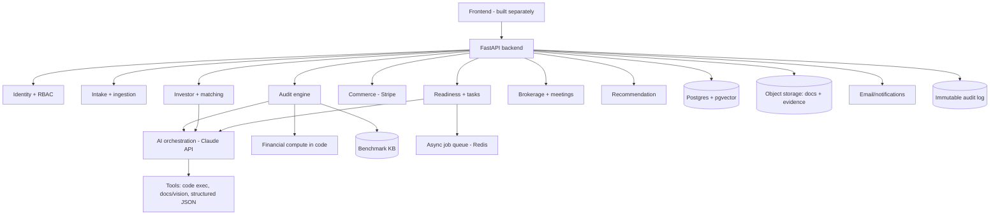

# FundReady — Product Requirements Document (PRD)
### AI Business Audit & Investor-Matching Platform · SACI Holdings
**Version:** 0.1 (working draft) · **Owner:** SACI Holdings · **Scope:** backend + AI (frontend built separately)

> **Working title:** "FundReady" is a placeholder — see the name shortlist shared separately; swap the name globally once chosen.

---

## 1. Overview

FundReady is a two-sided, SACI-brokered platform. Founders submit their business and receive a fully automated AI audit of whether it is **fundable** and **saleable** — with the reasons and a prioritized action plan. Startups that aren't ready are given specific, report-driven tasks (buy a program, take mentorship, revise a model); they do the work, upload evidence, and the AI assesses it before advancing them. Ready startups become discoverable — as summaries — to investors, who chat with an AI analyst, express interest, and book a meeting. SACI Holdings sits in the middle as the broker (SACI runs its own PE/VC), controlling the full report reveal, which happens at the meeting.

## 2. Goals & non-goals

**Goals**
- Give founders an honest, automated readiness verdict and a concrete path to fundability/saleability.
- Build a growing, pre-qualified database of investor-ready startups.
- Let investors discover and engage startups, with SACI as the controlling intermediary.
- Convert readiness gaps into demand for SACI/DSA programs — earned through real work, not payment alone.
- Run lean: minimal fixed infrastructure cost, pay-as-you-grow.

**Non-goals (v1)**
- No external/bank verification of founder data (internal consistency only).
- No human-graded audits (fully automated; internal QA sampling only).
- No open investor↔founder transactions on-platform unless later connected to the escrow platform (open item).
- Frontend is out of scope for this document.

## 3. Personas

- **Founder** — submits the business, receives the audit, works tasks, uploads evidence, subscribes, buys programs.
- **Investor** — KYC'd; discovers startups, chats with the AI analyst, views summaries, expresses interest, books meetings.
- **SACI Admin (broker)** — full visibility; lists programs/products; approves and mediates matches; controls full-report reveal.
- **System / AI** — runs audits, generates tasks, assesses evidence, powers both chat surfaces, recommends programs per country.

## 4. Key user flows

**4.1 Founder audit flow**
1. Founder subscribes and completes structured intake; uploads documents (deck, financials, cap table).
2. AI extracts everything into a canonical Startup Profile, flags missing fields, and runs a cross-document consistency check.
3. Financials are computed in code and compared to region-aware benchmarks.
4. The AI scores the business against the rubric and produces a verdict + reasons + action plan.
5. Founder receives their actionable audit and any assigned tasks.

**4.2 Readiness & evidence loop**
1. Blocking gaps become required tasks; other gaps become recommended tasks. Tasks are specific to that audit.
2. Founder completes a task (may include buying a program/mentorship) and uploads evidence of the outcome.
3. The AI evaluates the evidence against task-specific criteria → pass / fail / needs-more.
4. On pass, the affected dimensions are re-audited and readiness updates.
5. When the audit clears the bar **and** all required tasks pass, the startup becomes investor-visible (as a summary). A dispute/re-audit path exists to correct model errors.

**4.3 Investor discovery & brokerage**
1. Investor completes KYC and sets a thesis (sector, stage, ticket, geography, risk).
2. Investor discovers startups and chats with the AI analyst, which filters/ranks the database against the thesis and explains matches from the audits.
3. Investor views a **summary** of a startup and expresses interest.
4. Interest routes to SACI Admin, who approves/curates the match.
5. A meeting is booked (SACI is a required participant).
6. SACI reveals the **full report** at/around the meeting — never automatically.

**4.4 Admin (SACI) flow**
1. Lists and prices programs/products/events with tags and region relevance.
2. Reviews interest requests, approves matches, schedules meetings, controls reveals.
3. Has full visibility on every audit, task, evidence item, and log entry.

## 5. Functional requirements (by module)

- **Identity & access** — signup/login; roles (founder/investor/admin); row-level data isolation; field-level visibility flags; investor KYC gate.
- **Intake & ingestion** — structured forms; document upload; AI extraction into the Startup Profile with source + confidence per field.
- **Audit engine** — consistency check → financial compute → rubric scoring → synthesis → task generation; versioned rubrics; provisional status on thin data.
- **Benchmarks** — CRUD for benchmark entries keyed by sector × stage × metric × region, with source + date.
- **Readiness & tasks** — task generation, required/recommended flags, evidence upload, AI evidence assessment, re-audit trigger, investor-visibility gating, dispute path.
- **Commerce** — product/program catalogue; Stripe Checkout for purchases; founder subscriptions via Stripe Billing; webhook handling.
- **Investor & matching** — investor profiles/thesis; discovery/ranking; AI analyst chat over the database.
- **Brokerage & meetings** — interest expressions; SACI approval workflow; scheduling; tiered report reveal control.
- **Recommendation** — gap→program matching, per-country filtering, surfaced in chat and a browsable catalogue.
- **Notifications** — transactional email (audit ready, task assigned, evidence result, meeting booked).
- **Audit log & analytics** — immutable record of every reveal and admin action.

## 6. System architecture

Modular monolith to start (one deployable service with clear internal modules), split into services later as load grows. All access-control and report-tier rules are enforced server-side, never by the frontend.

**Request flow (audit):** intake → queue a background audit job → extraction → consistency check → financial compute → rubric scoring → synthesis → persist AuditRun + embeddings → notify founder. Long-running work runs off the request thread via the queue so the API stays responsive.

## 7. Tech stack (low-cost)

Chosen to keep **fixed** cost near zero at MVP and scale on usage. The main variable costs are Claude API tokens and Stripe fees.

| Layer | Choice | Why it's cost-efficient |
|---|---|---|
| Backend framework | FastAPI (Python) | Open-source; ideal for AI + financial computation; async and lightweight |
| Hosting (API + workers) | Render or Railway low tier; Hetzner VPS for lowest cost | Cheap tiers, simple deploys; move to a VPS to cut cost further as usage grows |
| Database + vectors | Neon (serverless Postgres + pgvector) | Cheap serverless Postgres, scales to zero; pgvector covers search — no separate vector DB |
| Authentication | Self-built in FastAPI (JWT + Argon2id + refresh rotation); optionally `fastapi-users` | Full control of role/tier/broker logic; no provider lock-in |
| Vector search | pgvector inside Postgres | Avoids a separate paid vector DB (e.g. Pinecone) |
| Async jobs / queue | Upstash Redis + Python worker (RQ/Celery) | Serverless Redis with a free tier; runs long audits off the request path |
| LLM / AI | Claude API | Pay-per-token; control cost with model tiering (cheaper model for chat, strong model for audits), prompt caching, and batching |
| Financial compute | In-backend Python (or Claude code execution) | Runs in your own service — no extra sandbox cost |
| Email | Resend (free tier) or AWS SES | Cheap transactional email |
| Payments & billing | **Stripe** (Checkout + Billing) | No monthly base; per-transaction only; Billing handles founder subscriptions |
| Investor KYC | Stripe Identity | Pay-per-verification; same vendor as payments |
| Meetings / scheduling | Cal.com (open-source) or Google Calendar API | Free / self-hostable |
| Doc & evidence storage | Cloudflare R2 | S3-compatible, zero egress fees — cheapest for file-heavy workloads (files are not stored in Postgres) |
| Monitoring | Sentry free tier + platform logs | Enough for MVP |

**On bundling:** a single-vendor BaaS (e.g. Supabase) was considered to cut the number of services, but the team chose an à la carte stack — Neon (DB + vectors) + self-built auth + Cloudflare R2 (files) — for full control of the custom auth/role/tier logic and to avoid lock-in. Cost stays comparable; all sit on cheap/free tiers. Neon is a database, not a file store — uploads go to R2.

**Rough cost profile:** at MVP, most services sit on free tiers — expect near-zero fixed monthly cost. Once live, cost scales mainly with Claude token usage (audits are the heaviest calls, so tier and cache aggressively), Stripe's per-transaction fee, and storage volume. This stack can run an MVP for very little and grow without a rebuild.

## 8. Non-functional requirements

- **Isolation:** founders must never access each other's data — enforced by app-layer ownership checks (primary), with optional Postgres RLS as a second wall.
- **Security:** least-privilege access; encryption at rest and in transit; immutable audit log on every report reveal and admin action.
- **Privacy / cross-border:** operating across NG/UAE/UK/US (and China in the group) means differing data rules — decide data residency deliberately (China's rules are strict).
- **Reliability:** audits run as idempotent background jobs; retriable; provisional status rather than false verdicts on failure.
- **Scalability:** stateless API behind the queue; start as a modular monolith, split hot modules later.

## 9. Payments & billing (Stripe)

- **Subscriptions:** founder plans via Stripe Billing.
- **Products:** events/mentorship sold via Stripe Checkout; the purchase record links to the relevant readiness task.
- **KYC:** investor verification via Stripe Identity.
- **Entity note:** Stripe does not onboard Nigeria-registered businesses directly (Nigeria is served via Paystack in Stripe's extended network). Bill through SACI's UK or US entity, whose Stripe accounts operate normally.
- **Connect:** because the platform mainly *collects* money (founder subscriptions + product fees) into SACI's account rather than paying out to many sellers, v1 likely does **not** need Stripe Connect — which avoids Connect's regional restrictions and keeps the integration simple. Revisit only if investor↔founder money moves on-platform (open item — would connect to the escrow platform).

## 10. Success metrics (initial)

- Audits completed; % reaching investor-ready.
- Task completion + evidence pass rate.
- Program/subscription conversion from recommendations.
- Investor interest → meeting → deal progression.
- Audit reliability: agreement with the golden set; dispute/overturn rate.

## 11. Milestones (phased)

- **Phase 1 — Foundations:** schema, auth/RBAC, founder intake, document ingestion & storage.
- **Phase 2 — Audit engine v1:** extraction, consistency check, financial compute, universal rubric, founder report + tasks; golden-set evaluation.
- **Phase 3 — Readiness loop:** task generation, Stripe commerce, evidence upload + AI assessment, re-audit, gating → investor-ready.
- **Phase 4 — Investor side & brokerage:** investor profiles/KYC, discovery + AI chat + summaries, interest → SACI approval → meeting → full reveal.
- **Phase 5 — Depth & hardening:** per-country benchmarks/recommendations, subscription billing polish, analytics, compliance & security review.

## 12. Risks & open questions

1. Founder report visibility — full actionable audit to the founder (assumed) vs summary only.
2. Evidence strictness and resubmission limits.
3. Data residency across NG/UAE/UK/US/China.
4. Whether investor↔founder money ever moves on-platform (escrow-platform integration).
5. Claude token cost at scale — mitigated by model tiering + prompt caching; monitor per-audit cost from day one.
6. Cold-start on the investor side — sequence founder-side first; seed the first cohort via SACI/Gtext's network.